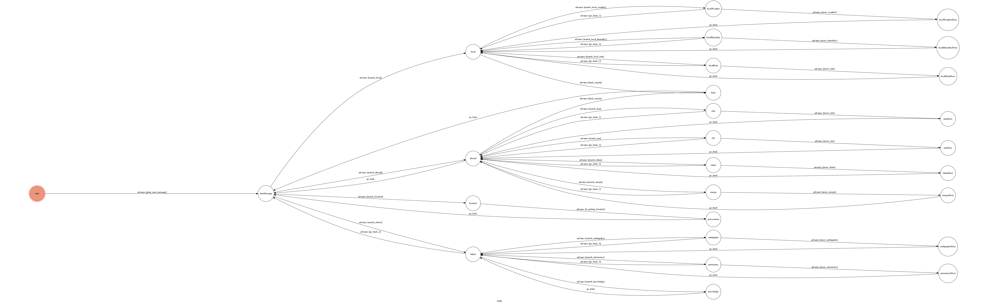

# TOC-Project-2017

Template Code for TOC Project 2017

A telegram bot based on a finite state machine

## Setup

### Prerequisite
* Python 3

#### Install Dependency
```sh
beautifulsoup4 (4.6.0)
Flask (0.12.1)
geocoder (1.22.6)
googlemaps (2.4.6)
python-telegram-bot (5.3.0)
requests (2.11.1)
transitions (0.5.0)
urllib3 (1.21.1)
```

* pygraphviz (For visualizing Finite State Machine)
    * [Setup pygraphviz on Ubuntu](http://www.jianshu.com/p/a3da7ecc5303)

### Secret Data

`API_TOKEN` and `WEBHOOK_URL` in app.py **MUST** be set to proper values.
Otherwise, you might not be able to run your code.

### Run Locally
You can either setup https server or using `ngrok` as a proxy.

**`ngrok` would be used in the following instruction**

```sh
ngrok http 5000
```

After that, `ngrok` would generate a https URL.

You should set `WEBHOOK_URL` (in app.py) to `your-https-URL/hook`.

#### Run the sever

```sh
python3 app.py
```

## Finite State Machine


## Usage
The initial state is set to `start`.

* start
	* 對bot說任何話，將會喚醒bot，它會介紹聊天機器人(以下簡稱Vic)所能提供的功能
	* go to state "startMessage"

* startMessage
	* Vic 提供的服務分為
		* 查詢國內氣象
		* 查詢國外氣象
		* [限手機板] 查詢當地氣象狀況
		* 其他
	* 根據user輸入(輸入代碼1 2 3 4即可)走到不同的state
	* go to state
		* 1: "local"
		* 2: "abroad"
		* 3: "location"
		* 4: "others"

* local
	* 國內氣象查詢所提供的服務含以下幾個
		* 天氣＆氣溫
		* 濕度
		* 累積雨量
	* 若對於Vic回應的資料尚覺得不夠，可以選擇"了解更多"，或是返回國內查詢
	* go to state
		* 1: "localWeather"  --> "localWeatherMore
		* 2: "localHumidity" --> "localHumidityMore"
		* 3: "localRain" --> "localRainMore"
		* 4: "startMessage" (Back)

* abroad
	* 可以查詢的國際都市有下列幾區
		* 亞洲、大洋洲
		* 歐洲、非洲
		* 美洲
		* 中國大陸
	* 若對於Vic回應的資料尚覺得不夠，可以選擇"了解更多"，或是返回國外查詢
	* go to state
		* 1: "asia"  --> "asiaMore
		* 2: "europe" --> "europeMore"
		* 3: "usa" --> "usaMore"
		* 4: "china"
		* 5: "startMessage" (Back)

* location
	* 對於手機板的telegram, Vic可以透過user send location by google map，來協助查詢該地氣候
	* APP: [attach] > [Location] > [Send Location]
	* Vic將即時回傳搜尋結果
	* go to state "startMessage" (Back)

* others
	* 除了基本的天氣查詢，Vic尚具備了以下幾種查詢功能
		* 近期國內地震資訊
		* 天文查詢
		* 每日科普知識
	* 若對於Vic回應的資料尚覺得不夠，可以選擇"了解更多"，或是返回其他查詢
	* go to state
		* 1: "earthquake" --> "earthquakeMore"
		* 2: "astronomy" --> "astronomyMore"
		* 3: "knowledge"
		* 4: "startMessage" (Back)

## Author
[vic](https://github.com/vic85821)